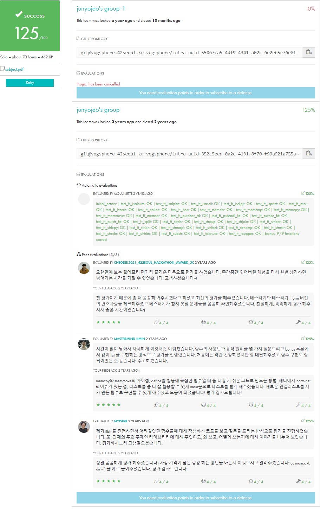

<div align="center">
  <h1>📚 Libft</h1>
  <p>42Seoul의 첫 번째 프로젝트: C 표준 라이브러리 재구현</p>

  

  [](https://github.com/junyjeon/Libft)
  [](https://github.com/42School/norminette)
  [](https://github.com/junyjeon/Libft/commits)
</div>

## 📋 목차
1. [소개](#-소개)
2. [함수 목록](#-함수-목록)
3. [구현 상세](#-구현-상세)
4. [설치 방법](#️-설치-방법)
5. [사용 예시](#-사용-예시)
6. [트러블슈팅](#-트러블슈팅)

## 📝 소개

### 프로젝트 목표
C 표준 라이브러리의 기본 함수들을 재구현하여 이후 42 과정에서 사용할 나만의 C 라이브러리를 만듭니다.

### 개발 제약사항
- 허용 함수: `malloc`, `free`, `write`
- 모든 함수는 `ft_` 접두어 사용
- [Norminette](https://github.com/42School/norminette) 코딩 규칙 준수
  - 함수 당 25줄 제한
  - 변수 선언은 함수 시작 부분
  - 들여쓰기는 탭 사용
  - 5개 이상의 매개변수 금지
  - for, do...while, switch 등 금지
- 정의되지 않은 동작 없어야 함
- 메모리 누수 없어야 함

## 📚 함수 목록

### Part 1: Libc 함수
| 함수 | 원형 | 설명 |
|------|------|------|
| ft_memset | `void *ft_memset(void *b, int c, size_t len)` | 메모리 초기화 |
| ft_bzero | `void ft_bzero(void *s, size_t n)` | 0으로 초기화 |
| ft_memcpy | `void *ft_memcpy(void *dst, const void *src, size_t n)` | 메모리 복사 |
| ft_memmove | `void *ft_memmove(void *dst, const void *src, size_t len)` | 메모리 이동 |
| ft_memchr | `void *ft_memchr(const void *s, int c, size_t n)` | 메모리에서 문자 검색 |
| ft_memcmp | `int ft_memcmp(const void *s1, const void *s2, size_t n)` | 메모리 비교 |
| ft_strlen | `size_t ft_strlen(const char *s)` | 문자열 길이 계산 |
| ft_strlcpy | `size_t ft_strlcpy(char *dst, const char *src, size_t dstsize)` | 문자열 복사 |
| ft_strlcat | `size_t ft_strlcat(char *dst, const char *src, size_t dstsize)` | 문자열 이어붙이기 |
| ft_strchr | `char *ft_strchr(const char *s, int c)` | 문자열에서 문자 검색 |
| ft_strrchr | `char *ft_strrchr(const char *s, int c)` | 문자열에서 문자 역방향 검색 |

### Part 2: 추가 함수
| 함수 | 원형 | 설명 |
|------|------|------|
| ft_substr | `char *ft_substr(char const *s, unsigned int start, size_t len)` | 부분 문자열 생성 |
| ft_strjoin | `char *ft_strjoin(char const *s1, char const *s2)` | 문자열 결합 |
| ft_strtrim | `char *ft_strtrim(char const *s1, char const *set)` | 문자열 양끝 제거 |
| ft_split | `char **ft_split(char const *s, char c)` | 문자열 분할 |
| ft_itoa | `char *ft_itoa(int n)` | 정수를 문자열로 변환 |

### Bonus Part: 연결 리스트
| 함수 | 원형 | 설명 |
|------|------|------|
| ft_lstnew | `t_list *ft_lstnew(void *content)` | 새 노드 생성 |
| ft_lstadd_front | `void ft_lstadd_front(t_list **lst, t_list *new)` | 노드를 리스트 앞에 추가 |
| ft_lstsize | `int ft_lstsize(t_list *lst)` | 리스트 크기 계산 |
| ft_lstlast | `t_list *ft_lstlast(t_list *lst)` | 마지막 노드 반환 |

## 💡 구현 상세

### 주요 구현 사례: ft_memmove
```c
void *ft_memmove(void *dst, const void *src, size_t len)
{
    unsigned char       *d;
    const unsigned char *s;

    if (!dst && !src)
        return (NULL);
    if (dst <= src)
    {
        d = (unsigned char *)dst;
        s = (const unsigned char *)src;
        while (len--)
            *d++ = *s++;
    }
    else
    {
        d = (unsigned char *)dst + (len - 1);
        s = (const unsigned char *)src + (len - 1);
        while (len--)
            *d-- = *s--;
    }
    return (dst);
}
```


## ⚙️ 설치 방법

1. 저장소 클론
```bash
git clone https://github.com/junyjeon/Libft.git
cd Libft
```


2. 컴파일
```bash
make        # 기본 라이브러리
make bonus  # 보너스 함수 포함
```


## 📖 사용 예시

### 기본 문자열 처리
```c
#include "libft.h"

int main(void)
{
    char *str = "Hello, 42Seoul!";
    size_t len = ft_strlen(str);
    char *dup = ft_strdup(str);
    
    // 문자열 처리
    if (ft_strncmp(str, "Hello", 5) == 0)
    {
        // 작업 수행
    }
    
    free(dup);
    return (0);
}
```


## 🔧 트러블슈팅

### 주요 체크포인트
1. NULL 포인터 검사
2. 메모리 누수 확인
3. 버퍼 오버플로우 방지
4. Norminette 규칙 준수

### Norminette 관련 주의사항
- [Norminette 문서](https://github.com/42School/norminette/blob/master/pdf/en.norm.pdf) 참조
- 주요 체크포인트:
  1. 함수 길이 (25줄 제한)
  2. 들여쓰기 (탭 사용)
  3. 변수 선언 위치
  4. 금지된 키워드 사용 여부

### 성능 최적화 팁
1. 불필요한 메모리 할당 피하기
2. 루프 최적화
3. 조건문 최소화

## 📚 참고 자료
- [42 Libft 서브젝트](https://github.com/42School/42cursus/tree/master/00_Libft)
- [C 표준 라이브러리 문서](https://devdocs.io/c/)
